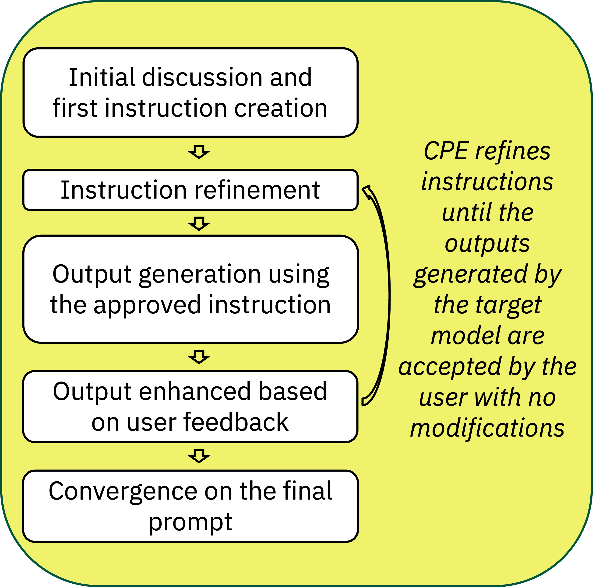

<p align="center">
   <a href="https://join.slack.com/t/conversationp-0js4284/shared_invite/zt-2q377kmi9-00FL2CZXtaR0TFkg2NwGdw">Join&nbsp;Slack</a>
   &emsp;
</p>

# CPE: Conversational Prompt Engineering

   

CPE is a prompt building assistant developed in IBM. This service is intended to help users build an effective prompt, tailored to their specific use case, through a simple chat with an LLM. 

This is an overview of the system:


**Table of contents**

[Installation](#installation)

[System configuration](#system-configuration)

[Free access to Watsonx](#free-access-to-watsonx)

[Using the system](#using-the-system)

[Reference](#reference)


## Installation
The system requires Python 3.10 (other versions are currently not supported and may cause issues).
1. Clone the repository:

   `git clone git@github.com:IBM/conversational-prompt-engineering.git`
2. cd to the cloned directory: `cd conversational-prompt-engineering`
3. Install the project dependencies :
    1. Install an environment management tool such as [miniforge](https://github.com/conda-forge/miniforge?tab=readme-ov-file#install)
    2. Restart your console
    3. Use the following commands to create a new anaconda environment and install the requirements:
    ```bash
    # Create and activate a virtual environment:
    conda create --yes -n cpe-env python=3.10
    conda activate cpe-env
    # Install requirements
    # If you wish to use Hugginface inference services, uncomment the relevant dependencied in the requirements.txt file.
    pip install -r requirements.txt
    # Go to conversational_prompt_engineering folder
    cd conversational_prompt_engineering
    ```

5. Start the CPE: run `streamlit run cpe_ui.py`. 

6. Currently, the system supports two LLM apis: Watsonx and Huggingface. If you wish to intergrate another LLM api, you can easily do so by adding a new class that inherits from [AbstLLMClient](https://github.com/IBM/conversational-prompt-engineering/blob/main/conversational_prompt_engineering/backend/util/llm_clients/abst_llm_client.py#L17). To use Watsonx, you need to provide you api key and project id in one of three ways ([see below on how to get access to Watsonx](https://github.com/IBM/conversational-prompt-engineering?tab=readme-ov-file#free-access-to-watsonx)):
   1. Enter your credentials in the UI.
   2. Add environment arguments to you execution environment: WATSONX_APIKEY and PROJECT_ID.
      1. If you use Watsonx, you should provide WATSONX_APIKEY and PROJECT_ID.
      2. If you use [Serverless Ingerence API by Huggingface](https://huggingface.co/docs/api-inference/en/index) you should provide HF_TOKEN (your Huggingface token).
      3. If you run you Huggingface model locally, you don't need to provide any credentials.
   3. Add .env file with your credentials (see the file .env.example for example)

7. By default all project files are written to `<home_directory>/_out`, to change the directory, please update the property OUTPUT_DIR in your config file.


## Free Access To Watsonx

<details>
<summary> follow these steps to obtain free access to Watsonx </summary>
IBM offers a free WastonX trial. To get a free acount with 200 USD cloud credit for free you should:
1. Go to [Create an IBM Cloud account](https://cloud.ibm.com/registration) page . 
2. Create your account in a 4 steps process: 
   1. Enter your email and choose a password. 
   2. Verify your email by entering the verification code that was sent to your email (look for an email with the subject "Your IBM Cloud verification code")
   3. Fill in the text boxes with your personal information. You can enter "None" in the company name text box, if this is irrelevant you use).
   4. Accept the terms and conditions of the registration form. 
3. Verify your identity by card - You must provide credit card info to get your 200 usd credit. Don't worry - IBM will not bill you as long as you don't exceed you free credit.
after you enter your billing address and credit card details, click on "Create Account". 


4. Your account is ready! Now you are ready to obtain your credentials.
5. In your [cloud account dashboard](https://cloud.ibm.com/), go to "manage" (on the top panel) and choose Access(IAM). On the left panel, choose "API keys" and click on "create". 


6. Once the key is created, you can copy it and/or download it. You won't be able to access this key again once you finish this key generation session, so make sure you have it backed up for further usage.
7. After you have your API key, proceed to the opening a project in [IBM Watsonx](http://dataplatform.cloud.ibm.com) (note that this is a different url). Begin with login in and selecting a region (we suggest you select the dallas region (us-south). If you select another region, please update the endpoint in [the models config file](https://github.com/IBM/conversational-prompt-engineering/blob/main/conversational_prompt_engineering/backend/model_params.json) accordingly.). 
8. On the top right menu, select projects->view all projects 


9. Click on "Create a new project" and fill in the necessary information (You only need to provide the project name).
10. In the "Manage" tab, select "Services & Integrations" (left panel) and check add the service "Watson Machine Learning-ol"
11. Still in the "Manage" tab, select "General" (left panel) and Copy your project.

12. You are all set!
</details>

## Using the system 

To use and evaluate CPE, proceed according to the following steps: 
1. When you run the system, you need to select your `target model`, which is the model you'll be creating prompts for. Currently we support 3 target models:   `llama-3-70b-instruct`, `mixtral-8x7b-instruct-v01` and `granite-3-8b-instruct`.
2. Start by generating a cvs file with 3 examples of texts most related to your daily work, and upload it. Your csv file should contain a single column titled "text". Each row is a single input example to CPE. If your input examples should contain multiple sentences/paragraphs, make sure they fit a single row. Alternatively, you can select a dataset from our catalog.
3. Follow the chat with the system. These are the phases of the chat: 
   1. Once the system notifies you that the final prompt is ready, you will be presented with the outputs generated by the prompts. 
   2. For each output, you can present your comments and or modifications. The system will generate a new prompt, if needed, initialize another round of outputs confirmation.
   3. Once the prompt is ready, you can download two versions: 
      1. `zero shot prompt`: It includes only the instructions generated during the chat. 
      2. `few shot prompt`: It includes the instructions and also the three text examples and approved outputs. 
   4. After you generate a prompt, you can proceed to evaluation in the Evaluation tab. 
      1. You will be presented with the compared prompts (according to your chosen configuration). You begin with the upload of an examples csv files (similar format to the input csv file you used in the chat phase).
      2. When you click on the "generate outputs" button, the system generates all the output for the compared prompts over the examples in your csv file. 
      3. You will be presented, for each example, the generated output. These outputs are shuffled and source prompt is not disclosed to you. For each example, select the best and worst output.
      4. Once you reach the required minimum of annotated examples, you can submit your annotation and get the analysis per each prompt.


## System configuration

CPE will be available at http://localhost:PORT, where PORT is the port assigned by Streamlit (usually between 8501 to 8505). If you wish to specify the port you want to use, run `streamlit run cpe_ui.py --server.port YOUR_PORT` where YOUR_PORT is the port you wish to use.

Different system properties can be set up in configurations files. The default configuration used by the system is `main` (config file is [here](https://github.com/IBM/conversational-prompt-engineering/blob/main/conversational_prompt_engineering/configs/main_config.conf)). If you want to use different configuration, run `streamlit run cpe_ui.py CONFIG`, where CONFIG is the name of the desired configuration. Make sure you add a file named CONFIG_config.conf to `conversational_prompt_engineering/configs`

The configurable parameters of the system are specified config files that are placed in `conversational_prompt_engineering/configs`.

**Configurable parameters:**

| Section    | Parameter                  | Description                                                                                                                                                                                                                                                                                                                                                                                                                                                                                                                                                       |
|------------|----------------------------|-------------------------------------------------------------------------------------------------------------------------------------------------------------------------------------------------------------------------------------------------------------------------------------------------------------------------------------------------------------------------------------------------------------------------------------------------------------------------------------------------------------------------------------------------------------------|
| General    | `chat_llm_api`             | The chat llm client (one of: [WatsonXClient](https://github.com/IBM/conversational-prompt-engineering/blob/main/conversational_prompt_engineering/backend/util/llm_clients/watsonx_client.py#L14), [HFRemoteClient](https://github.com/IBM/conversational-prompt-engineering/blob/main/conversational_prompt_engineering/backend/util/llm_clients/hf_remote_client.py#L13), [HFLocalClient](https://github.com/IBM/conversational-prompt-engineering/blob/main/conversational_prompt_engineering/backend/util/llm_clients/hf_local_client.py#L14)                 |
| General    | `target_model_llm_api`     | The llm client for the target model (one of: [WatsonXClient](https://github.com/IBM/conversational-prompt-engineering/blob/main/conversational_prompt_engineering/backend/util/llm_clients/watsonx_client.py#L14), [HFRemoteClient](https://github.com/IBM/conversational-prompt-engineering/blob/main/conversational_prompt_engineering/backend/util/llm_clients/hf_remote_client.py#L13), [HFLocalClient](https://github.com/IBM/conversational-prompt-engineering/blob/main/conversational_prompt_engineering/backend/util/llm_clients/hf_local_client.py#L14) |
| General    | `output_dir`               | The output repository where all output files and logs are stored.                                                                                                                                                                                                                                                                                                                                                                                                                                                                                                 |
| General    | `ds_script`                | The scripts the load the list of supported dataset in the datasets droplist in the UI.                                                                                                                                                                                                                                                                                                                                                                                                                                                                            |                                                                                                                                                                                                                                                             |
| UI         | `background_color`         | The background color of the UI.                                                                                                                                                                                                                                                                                                                                                                                                                                                                                                                                   |
| Evaluation | `prompt_types`             | The list of prompts that are compared in the evaluation tab. The options are: `baseline`, `zero_shot` and `few_shot`. `baseline` is generated by the LLM after the user briefly explain their task. `zero_shot` and `few_shot` prompts are generated at the end of the conversation.                                                                                                                                                                                                                                                                              |
| Evaluation | `min_examples_to_evaluate` | In the evaluation tab, the minimal number of examples the user needs to annotate before submitting threir annotations.                                                                                                                                                                                                                                                                                                                                                                                                                                            |


## Reference
Liat Ein-Dor, Orith Toledo-Ronen, Artem Spector, Shai Gretz, Lena Dankin, Alon Halfon, Yoav Katz, Noam Slonim. [Conversational Prompt Engineering](https://arxiv.org/abs/2408.04560).

Please cite:
```
@misc{eindor2024conversationalpromptengineering,
      title={Conversational Prompt Engineering}, 
      author={Liat Ein-Dor and Orith Toledo-Ronen and Artem Spector and Shai Gretz and Lena Dankin and Alon Halfon and Yoav Katz and Noam Slonim},
      year={2024},
      eprint={2408.04560},
      archivePrefix={arXiv},
      primaryClass={cs.CL},
      url={https://arxiv.org/abs/2408.04560}, 
}
```


